# NOAH ✈

## 시연 시나리오

### 01. 회원가입 페이지 🧑👩

1. 이메일 인증  메일로 받은 인증코드로 이메일 인증
2. 비밀번호 유효성 검사  영문 대소문자, 숫자 각 1개 이상 조합하여 5자 이상  SQL Injection 고려한 특수문자 제한 (!, @, $, %, ^, & 만 가능)
3. 이름 유효성 검사  한글(자음 또는 모음만 존재하는 것 제외)을 조합해 2-5자
4. 닉네임 유효성 검사  한글만 가능하며 2-8자
 
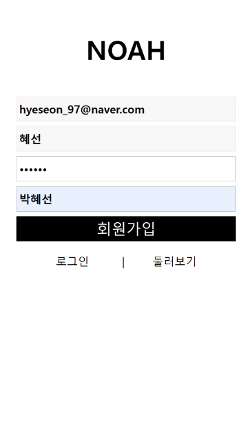{: width="324" height="576"}

### 02. 로그인 페이지 🔐

이메일, 비밀번호로 로그인

**둘러보기** 
회원가입을 하기 전 NOAH가 어떤 서비스인지 기능들을 둘러볼 수 있는 기능
 
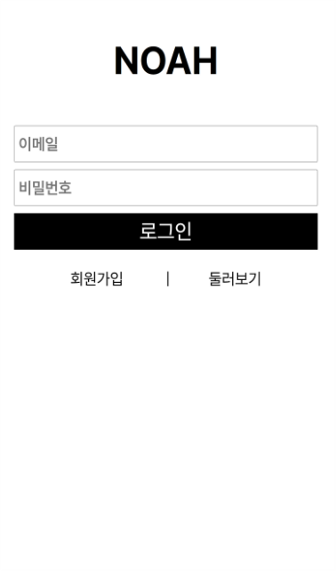{: width="324" height="576"}

### 03. 메인 페이지 📱

1. 여행 모임통장 정보  여행 제목, 모임통장 계좌 번호, 계좌 잔액, 목표 금액 표시  계좌 번호로 바로 송금 가능
2. 환율 정보  실시간 환율 정보 제공  달러, 엔화, 위안화, 유로 환율 제공
3. 추천 후기 정보  목표금액에 따른 인당 경비 기준으로 여행지 추천  목표금액 미설정인 경우 랜덤 추천 
 
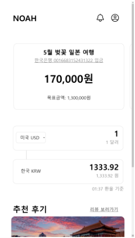{: width="324" height="576"}
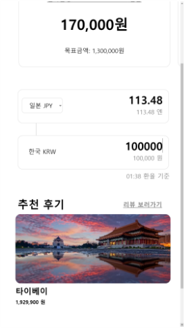{: width="324" height="576"}

### 04. 모임 통장 송금 💸

1. 마이데이터(싸피금융망)를 통해 내 계좌 조회
2. 사용할 계좌와 송금 금액 입력 후 모임 통장으로 송금
 
{: width="324" height="576"}
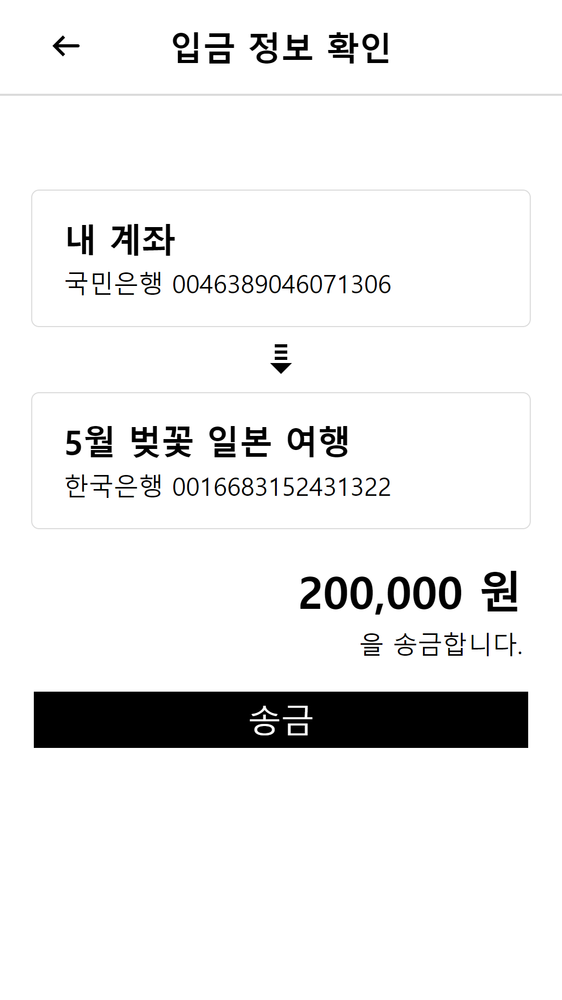{: width="324" height="576"}

### 05. 추천 리스트 페이지 🧳

1. 모임 통장의 목표 금액에 따른 추천 여행 리스트  도시명, 여행인원, 총 경비, 여행일수 정보 제공
2. 인당 경비를 기준으로 내림차순하여 최적의 여행지를 추천
 
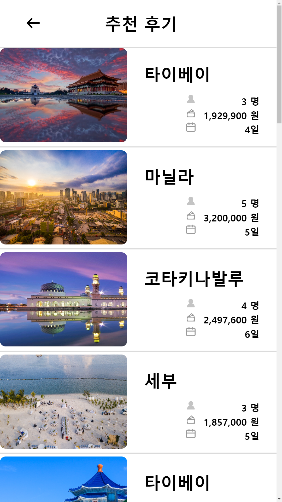{: width="324" height="576"}

### 06. 여행 생성 페이지 🧑👩

여행 이름과 모임 통장 은행 선택 

**은행 종류** 
한국은행, 기업은행, 산업은행, 국민은행
 

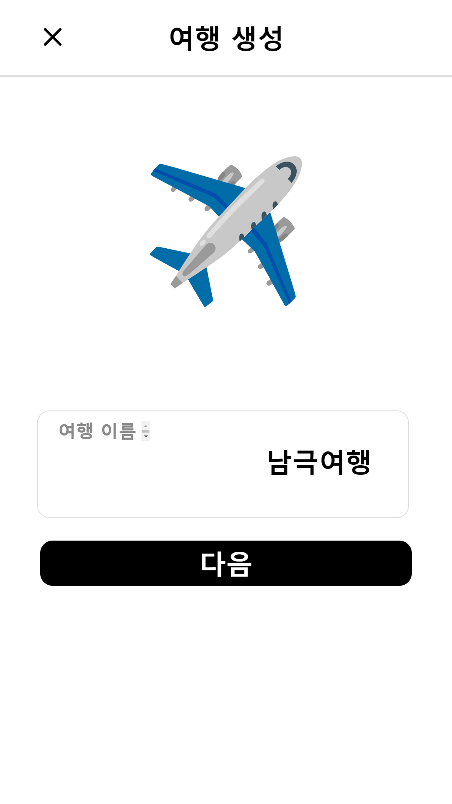{: width="324" height="576"}
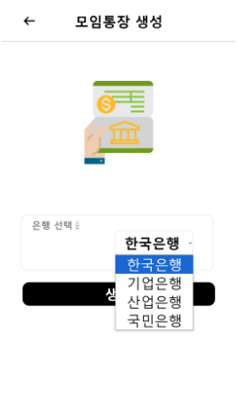{: width="324" height="576"}

### 07. 여행 정보 페이지 🧑👩

1. 모임 통장 정보  목표금액에 따른 모은 금액 비율 그래프로 표시
2. 여행 계획 정보  여행 시작일까지 남은 일 수 디데이로 표시  여행 날짜와 도시 정보 제공
3. 여행 관련 서비스  1) QR 결제  2) 환전  3) 소비관리  4) 인원관리
 
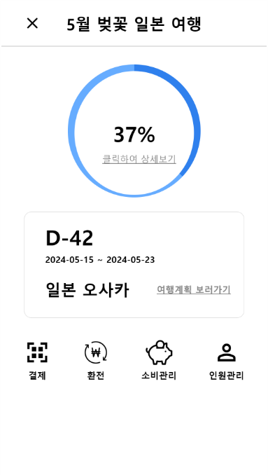{: width="324" height="576"}

### 08. 모임 통장 관리 페이지 🧑👩

1. 여행 목표 설정  목표금액, 목표기간, 월별 납입금액, 납입날짜 설정(월별 납입금액 및 납입날짜는 자동이체 계좌 등록 시 반영되어 자동이체 기능 동작)
2. 달성 인원  매 달 월별 납입금액에 해당되는 돈을 입금한 사람을 표시
 
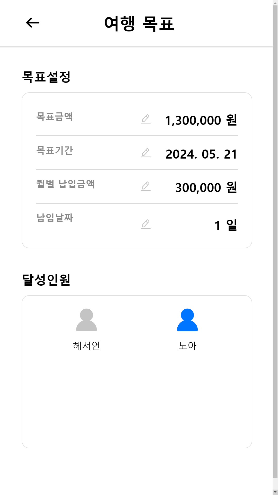{: width="324" height="576"}

### 09. 여행 계획 관리 페이지 🧑👩

1. 계획 기본 정보와 함께 여행의 날짜별로 계획 작성
2. 항공편부터 구글맵 기반의 장소까지 등록 가능

**항공권 검색** 
출발지와 도착지, 탑승 날짜를 선택해 다양한 시간대의 항공편을 검색하고 계획에 추가
 

{: width="324" height="576"}
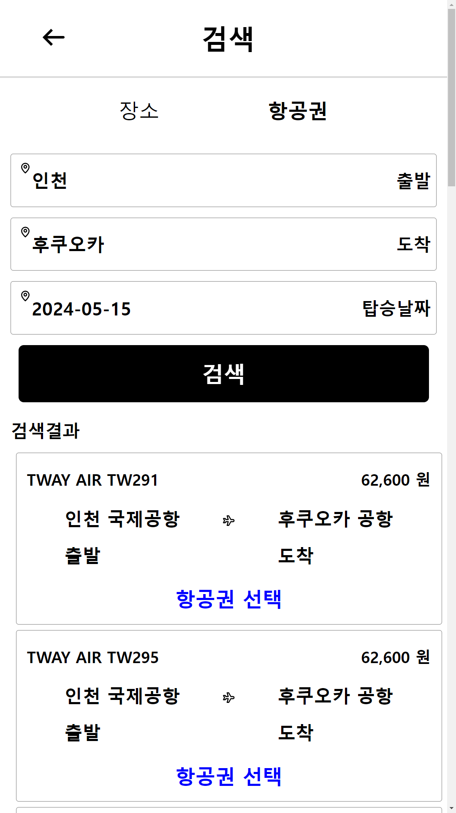{: width="324" height="576"}

**장소 검색** 
1. 구글맵 API를 사용한 장소 검색
2. 장소에 대한 자세한 정보 제공  주소, 가게정보, 리뷰, 평점 등  리뷰 더보기로 사진과 함께 자세한 리뷰가 제공
3. 원하는 장소를 계획에 추가
 
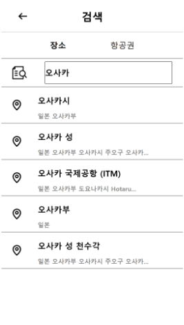{: width="324" height="576"}
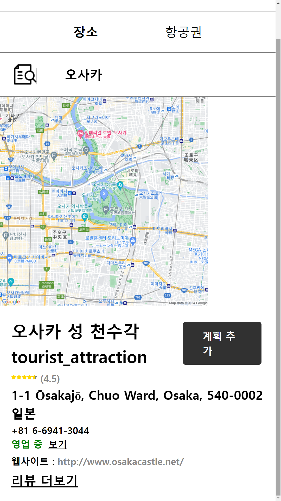{: width="324" height="576"}

### 10. QR코드 결제 페이지 🧑👩

**QR결제 코드 페이지** 
모임 통장 특성 상 하나의 카드로 여러명이 사용해야 하는 제한으로 여행에 포함된 모든 사용자가 QR코드 결제로 모임 통장을 사용할 수 있게 함

**결제 승인 페이지** 
가게에서 QR을 찍어 자동결제가 되게 하는 것을 구현
(실제로는 가게마다 가게명이 등록되어 있고 결제금액도 포스기에 저장되어 있지만 서비스 구현을 위해 가게 페이지를 생성함)
 
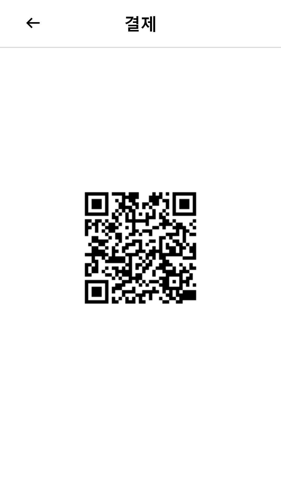{: width="324" height="576"}
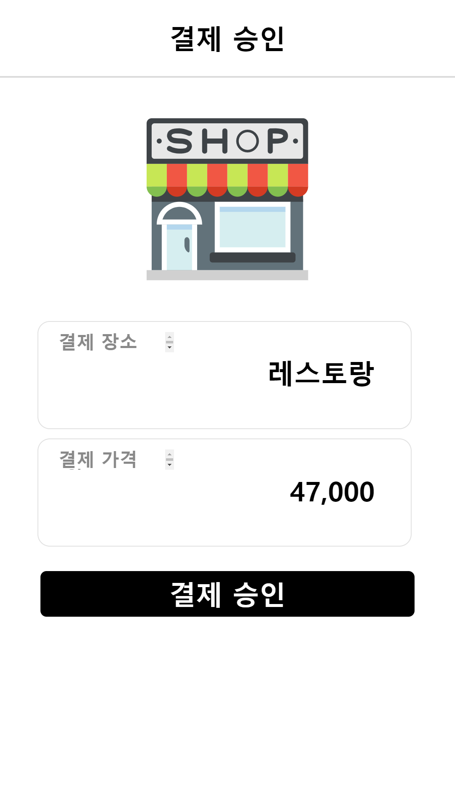{: width="324" height="576"}

### 11. 환전 페이지 🧑👩

1. 여행 가기 직전이 아닌 여행을 준비하는 기간동안 원하는 환율일 때 모임 통장 공금으로 미리 환전 가능 -> 여행 당일에 공항에서 환전해둔 외화를 받을 수 있음
2. 원하는 환율이 되었을 때 실시간 푸시알림 설정
 
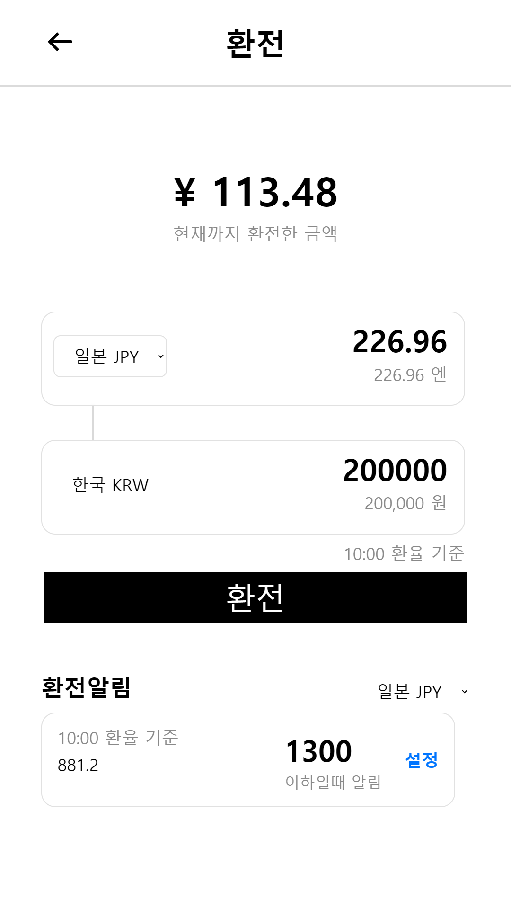{: width="324" height="576"}

### 12. 소비 관리 페이지 🧑👩

**모임 통장 거래 내역 조회** 
모임 통장의 입출금 내역 조회소비분류, 사용자분류로 소비 관리 가능 
[ 소비분류 ] 
식비, 숙박, 항공/교통, 환전, 쇼핑, 기타 
[ 사용자분류 ] 
공동, 멤버명 

NOAH 서비스 내의 송금, 환전, QR결제 등은 사용자와 소비타입을 자동으로 분류해서 사용자에게 편의성을 제공
 

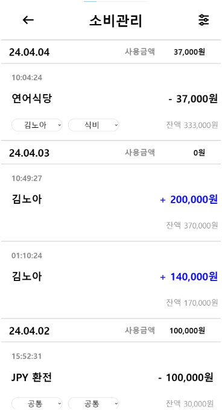{: width="324" height="576"}

**소비분류, 사용자분류에 따른 비율 정보** 
모임 통장의 전체 입금액, 출금액 대비 선택한 분류 항목에 대한 합계와 비율을 시각적으로 표현
사용자별, 소비분류별로 거래내역과 비율을 계산해볼 수 있음
 

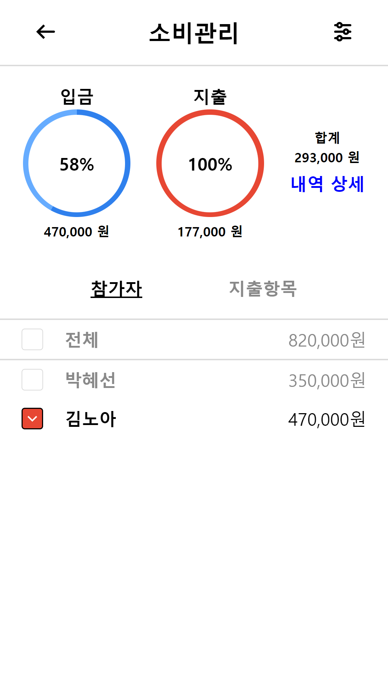{: width="324" height="576"}
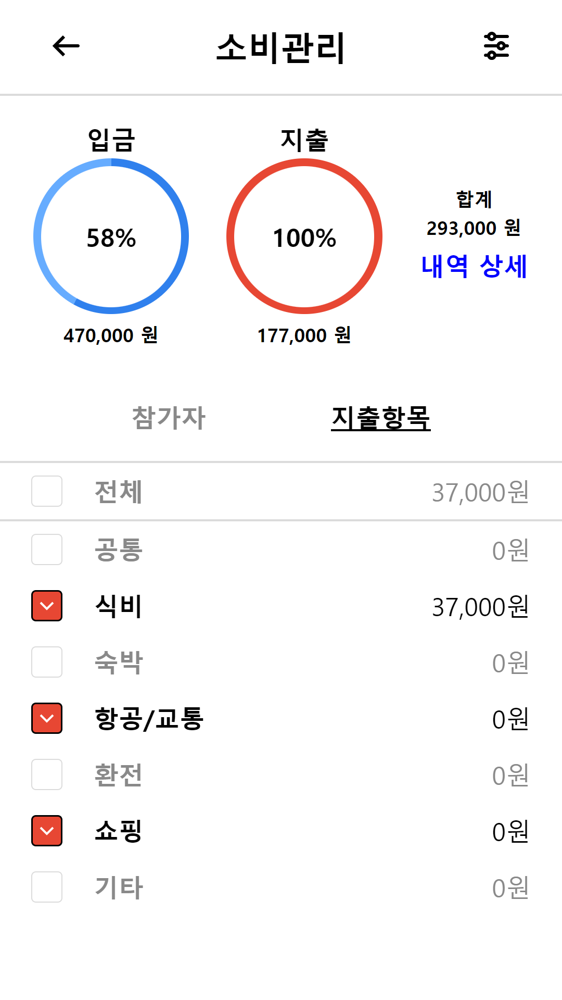{: width="324" height="576"}

### 13. 인원 관리 페이지 🧑👩

1. 멤버별 이번 달 납입금 정보 제공
2. 이메일로 새로운 멤버 초대 -> 초대 수락 여부 알림 전송
 
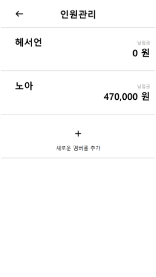{: width="324" height="576"}
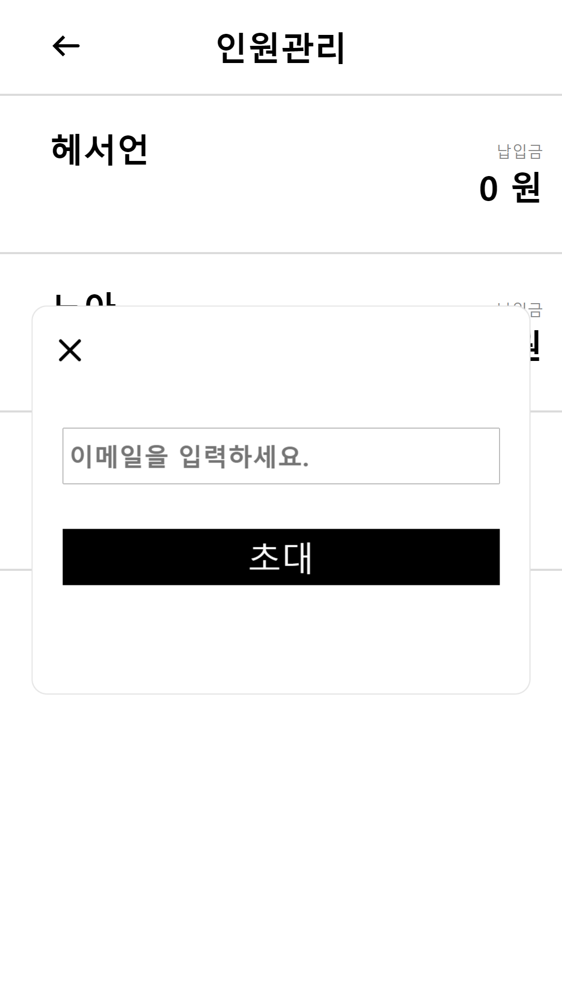{: width="324" height="576"}

### 14. 알림 🧑👩

3가지 타입의 알림이 알림창에서도 조회가 가능하며 FCM 푸시 알림 기능도 제공 

[ 알림 타입 ] 
TYPE1. 초대 알림 - 여행에 초대되었을 때 수락/거절 할 수 있는 알림 
TYPE2. 납부일안내 알림 - 여행의 납부일이 되었을 때 오전 9시 알림 
TYPE3. 환율 알림 - 설정해놓은 환율에 도달했을 때 실시간 알림 
 
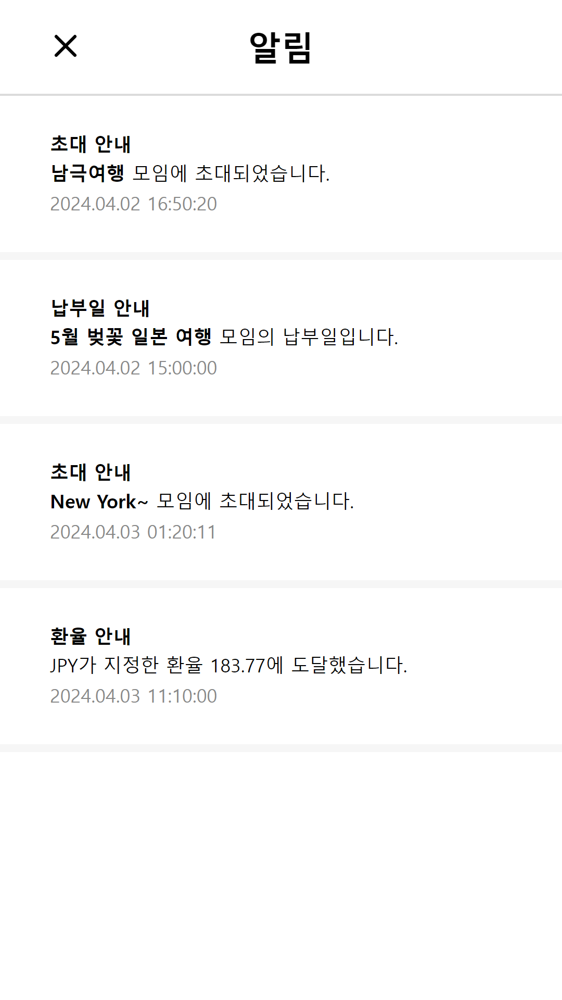{: width="324" height="576"}
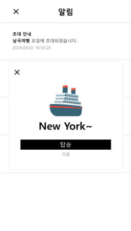{: width="324" height="576"}

### 15. 마이페이지 🧑👩

**내 여행 기록** 
1. 지난여행, 계획한 여행 등 모든 나의 여행 조회
2. 지난여행은 사진과 함께 후기를 등록할 수 있음
3. 후기 등록 후 코멘트를 등록해 다른 사용자들에게 추가로 여행 정보를 제공 가능

**내 계좌** 
마이데이터 조회로 나의 모든 계좌 조회
 
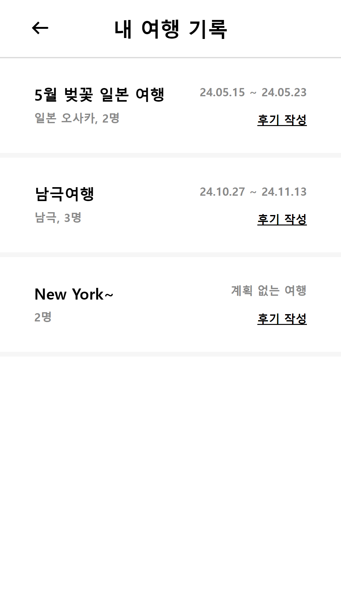{: width="324" height="576"}
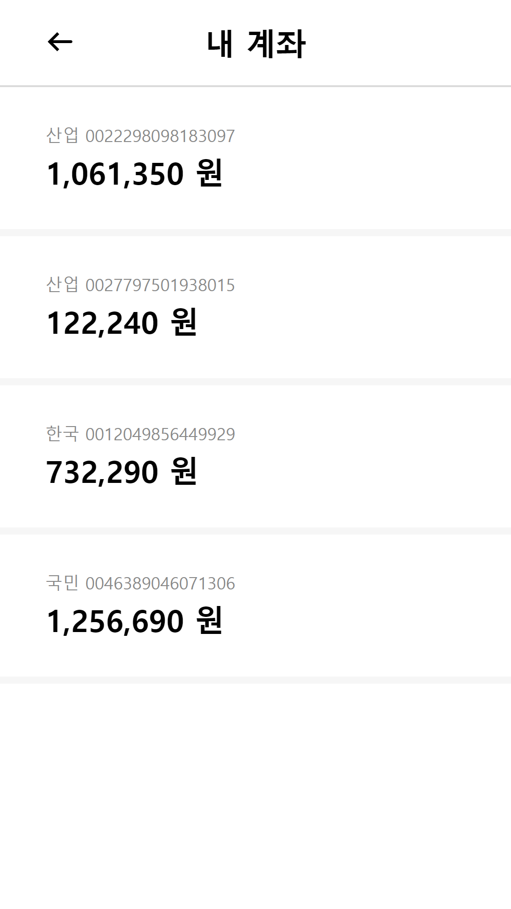{: width="324" height="576"}

**자동이체 설정** 
1. 여행별로 자동이체를 허용하고 싶을 때 내 계좌 중 한개를 선택해서 등록
2. 모임 통장 관리에 있는 납입일, 납입금에 따라 자동이체 진행
 
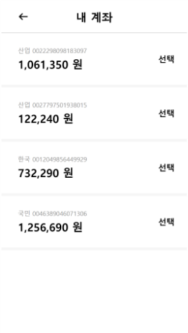{: width="324" height="576"}
